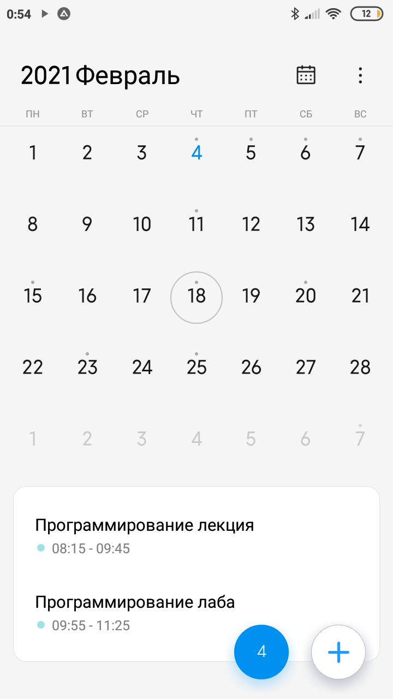
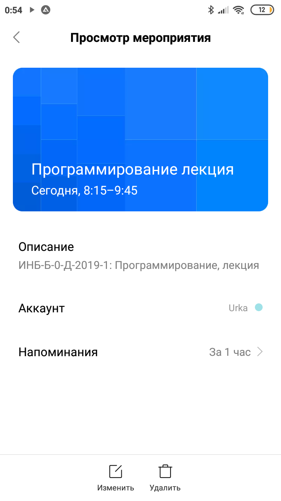

# Веб приложение преподавателя РГСУ
Здесь реализуются наработки консольных приложений на Python в виде веб-приложения.

В частности, расписание преподавателя РГСУ основано на скриптах из репозитория [rgsu_timetable](https://github.com/vol1ura/rgsu_timetable).

## Расписание занятий
После импорта `csv` файла в Google календарь, получаем отображение всех записей из расписания и автоматические напоминания за 1 час (по умолчанию).

 

## Запуск приложения

Приложение можно развернуть автоматически с помощью с помощью Docker
```bash
docker pull vol1ura/rgsu_timetable
docker run --rm -p 5000:5000 vol1ura/rgsu_timetable
```
